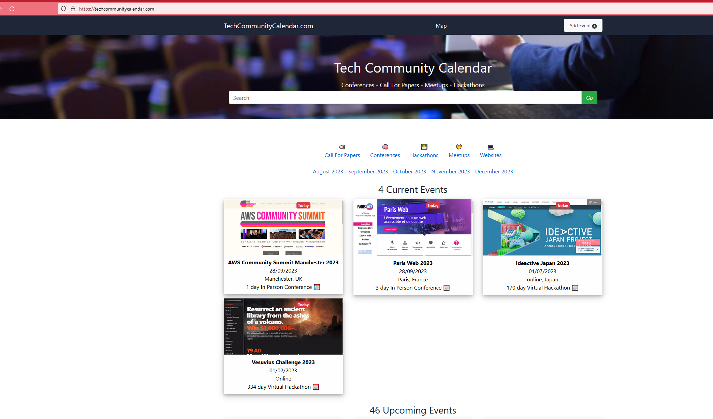

# Tech Community Calendar
The Tech Community Calendar is THE place to check for upcoming events in the tech community and lists conferences, hackathons and meetups happening around the world and when live will exist at www.TechCommunityCalendar.com.

Eventually we want the site to be managed by the tech community itself so that it is ran *by* the community, *for* the commmunity.

[](http://commitizen.github.io/cz-cli/)


[](https://avanade.github.io/code-of-conduct/)
[](https://avanade.github.io/code-of-conduct/)


```
Update the repo URL addresses for the shield templates.
LE: These may require the repo to be public?
DELETE THIS COMMENT
```

## Overview
The Tech Community Calendar will show events of interest to the tech community from around the world and will be filterable by event type and country.




## Licensing
Tech Community Calendar is available under the [MIT Licence](./LICENCE).


## Documentation
The `docs` folder contains [more detailed documentation](./docs/start-here.md), along with setup instructions.


## Contact
Feel free to [raise an issue on GitHub](https://github.com/Avanade/TechCommunityCalendar/issues), or see our [security disclosure](./SECURITY.md) policy.

## Contributing
Contributions are welcome. See information on [contributing](./CONTRIBUTING.md), as well as our [code of conduct](https://avanade.github.io/code-of-conduct/).

If you're happy to follow these guidelines, then check out the [getting started](./docs/start-here.md) guide.


## Who is Avanade?

[Avanade](https://www.avanade.com) is the leading provider of innovative digital and cloud services, business solutions and design-led experiences on the Microsoft ecosystem, and the power behind the Accenture Microsoft Business Group.


